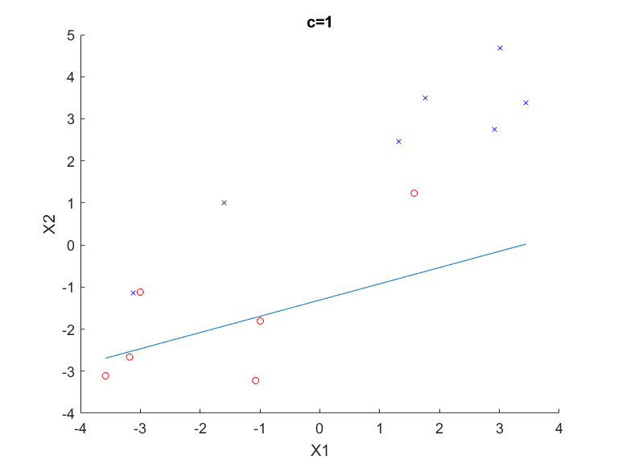
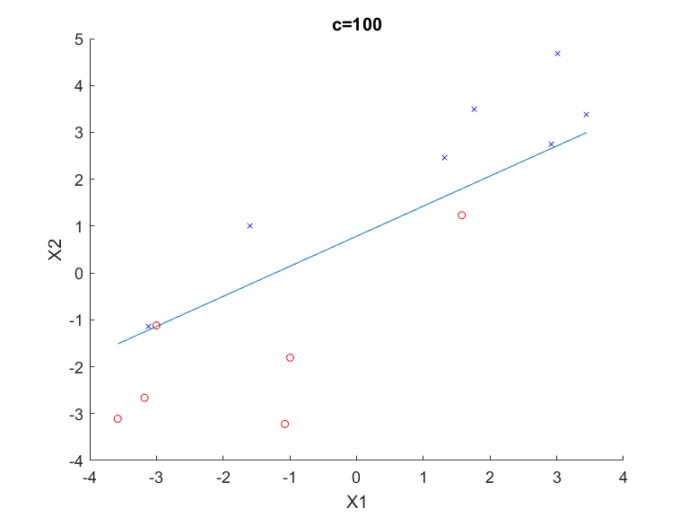
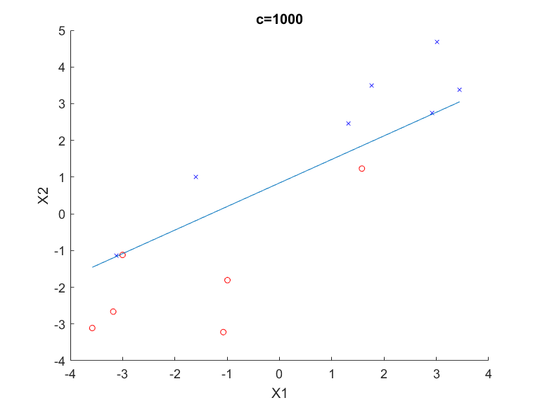

# My own implementation of SVM in MATLAB

Here are files of my own implementation of [Support Vector Machine](https://en.wikipedia.org/wiki/Support_vector_machine) (SVM) in MATLAB.

## Dataset

MATLAB [sample data set](https://ww2.mathworks.cn/help/stats/sample-data-sets.html) Fisher's 1936 iris data (`fisheriris`) consists of measurements on the 

* sepal length, 
* sepal width, 
* petal length,
* petal width 

for 150 iris specimens. There are 50 specimens from each of three species.

## SVM

The following are the demo of SVM using 

## Transductive SVM (TSVM)

The following are the demo of TSVM using MATLAB [sample data set](https://ww2.mathworks.cn/help/stats/sample-data-sets.html) Fisher's 1936 iris data (`data_fisheriris`).

## SSVM-SPSI

To do...
